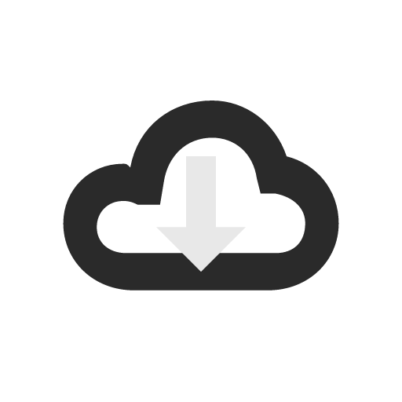

<div align="center">
  
  <h1>MiBackup_sly</h1>
  <p><b>小米云备份助手</b> · 把小米备份存到你自己的云盘 / NAS / 电脑</p>
  <p>
    
    
    &nbsp;
    
    
    &nbsp;
    
    
    &nbsp;
    
  </p>
</div>

---

## 项目介绍

小米手机自带的「小米备份」只能存到小米云或本地。**MiBackup_sly** 是一个 Xposed / LSPosed 模块：它向小米备份提供一个「虚拟小米智能存储设备」，把备份与恢复的文件操作重定向到**你自己的存储**——NAS、自建脚本、8 家云盘，或直连电脑。小米备份原本怎么用，现在还怎么用，只是目标换成了你自己的存储。

本项目是 [XPoser\_MiBackup](https://github.com/zgcwkjOpenProject/XPoser_MiBackup) 的延伸版本，在原版 SMB / WebDAV / 自定义脚本三通道基础上，新增多账号管理、凭据加密存储（AES-256-GCM）、云盘 Provider、OAuth2 / 会话自动刷新、备份至 PC 等能力。

- 源码：https://github.com/suileyan/xpmibackup_sly
- 下载（签名 APK + 电脑端 mibackpc.exe）：https://github.com/suileyan/xpmibackup_sly/releases
- 各版本变更见 [CHANGELOG.md](CHANGELOG.md)

## 支持通道

共 **12 种可用通道**：NAS 2 种 + 自建 2 种 + 云盘 8 种。

| 分类 | 通道 | 登录方式与说明 |
| --- | --- | --- |
| NAS | **SMB/CIFS** | 填服务器地址、共享名与账号；匿名访问可留空用户名 |
| NAS | **WebDAV** | 必须 HTTPS（Android 系统要求） |
| 自建 | **自定义 HTTP 脚本** | 用 JS 脚本对接任意存储；内置 SSRF 防护与 Rhino 沙箱 |
| 自建 | **备份至 PC** | 配套电脑端 mibackpc，自动发现 + 配对，USB 通道优先 |
| 云盘 | 移动云盘（139） | 内嵌网页登录 |
| 云盘 | 光鸭云盘 | 内嵌网页登录；OAuth2 Token 自动刷新 |
| 云盘 | 夸克云盘 | 内嵌网页登录；`__puus` 会话自动续期 |
| 云盘 | 阿里云盘 | 内嵌网页登录；secp256k1 设备签名，refresh_token 轮换 |
| 云盘 | **Google Drive** | 系统浏览器 loopback 授权（Google 拒绝 WebView 内 OAuth）；scope 为 `drive.file`，只管理本模块上传的文件；需能访问 Google |
| 云盘 | 天翼云盘（189） | 内嵌网页登录；refresh_token / SSON 双链路续期 |
| 云盘 | 百度网盘 | 内嵌网页登录 |
| 云盘 | 联通沃盘 | 内嵌网页登录 |

> 已暂停支持：123 云盘（v0.9.5 起）、115 网盘（v0.8.0 起）。代码保留，存量账号仍可被识别，但不再展示登录入口。

## 原理

小米备份 App 通过 DFS 服务连接小米智能存储设备，经 AIDL 接口执行目录查询、文件上传、下载和进度回调。本模块注入 `com.android.settings` 与 `com.miui.backup` 两个进程：在设置页注入配置入口，并在备份 App 的 DFS/AIDL 边界把文件操作改由所配置的云端协议完成。

```text
小米备份 App
  -> 查询智能存储设备：返回虚拟设备
  -> 连接 DFS 服务：模拟在线和已连接
  -> DFS AIDL 上传：写入所配置的通道（NAS / 脚本 / 云盘 / PC）
  -> DFS AIDL 下载：从对应云端读取
  -> 进度与完成回调：回传给小米备份原流程
```

主要 Hook 边界停留在 DFS AIDL、设置页入口和明确的备份 UI/服务事件，避免直接依赖混淆业务函数，提升对小米备份版本变更的兼容性。

## 功能

### 传输与存储

- 在系统设置中注入「云备份助手」配置入口
- 拦截 DFS 连接，模拟小米智能存储设备在线状态
- 大文件在 Cloud 层统一切片上传，所有协议共用同一套切片逻辑
- **上传并发与切片集中配置**：「备份配置」页统一管理三项参数——上传线程数（单个文件切片后的并行分片数）、切片大小、备份项并发（同时上传的备份项个数，设为 1 即逐项备份）
- **手机端峰值占用可控**：切片前取「在途分片额度」（背压），磁盘分片锁死在 `(并发 + 2) × 切片大小`（默认 ≤640MB，备份项并发为 1 时 ≤192MB）；不整份复制源文件；孤儿分片自动清理（6 小时阈值，不误伤在途分片）
- **实时上传速率**：备份页总进度条右侧显示每秒刷新的速率角标
- **取消即停**：取消备份后 1~2 秒内停止上传（最多再传完当前一片）；失败或取消一律不删本地源文件
- **进度口径修正**：按宿主自己的分母折算上报，备份项进度不再「贴住 30% 后直接跳 100%」
- 多账号 / 多方案并存：NAS 方案（SMB / WebDAV / 脚本）与云盘账号可同时保存，按需切换备份目标
- 自动清理超出「最大备份数」的旧备份；可开启「上传完成后自动删除本地备份文件」

### 备份至 PC（mibackpc）

- 备份页自动扫描局域网 / USB 发现电脑端 mibackpc（`pc/` 目录），手机弹窗连接 + 电脑端确认配对，免手动填地址
- **USB 通道优先**：电脑端在「设备在线但 `adb reverse` 未建立」时自动建通道；手机发现 `127.0.0.1` 有应答即把方案切到 USB（**仅当电脑名与已配对的一致**，避免把备份写到别的机器），拔线后自动回落局域网，无需重新配对
- 电脑端 PUT 前做磁盘空间预检，空间不足返回 507 并给出可读原因，避免写满接收端后落一堆半截文件

### 界面

- 配置界面按小米 HyperOS 设计语言
- 底栏支持**悬浮 dock / 贴边**两种样式（设置页切换，即时生效）：悬浮为居中胶囊 dock，带圆角、投影与 85% 半透明表面，API 31+ 下叠加实时背景模糊，系统不支持时自动退化为纯半透明玻璃感
- 顶部「备份」按钮点击进入智能存储备份页，长按进入备份升级页

### 兼容与安全

- 凭据加密存储：密码、Token、Cookie 经 AES-256-GCM 加密落盘，按账号隔离
- Android 11~17 适配：edge-to-edge（含底部导航栏 insets，仅 Android 15+ 强制）、Android 17 本地网络保护（SMB/WebDAV 专项提示）、static final 反射限制审计、配置变更行为兼容
- Hook 跨版本兼容（HIGH-25）：小米备份类名 / 混淆方法名漂移时多候选自动降级 + 诊断日志，DFS AIDL transact code 漂移可观测
- 自定义 HTTP 脚本通道内置 SSRF 防护与 Rhino JS 沙箱（ClassShutter deny-all + 30s watchdog）；WebView 登录关闭文件访问与通用 JS 接口

## 环境要求

| 项目 | 要求 |
| --- | --- |
| 系统版本 | Android 11.0 ~ 17（minSdk 30 / targetSdk 37） |
| Xposed 框架 | LSPosed / LSPatch / EdXposed（Xposed API 82+） |
| 模块作用域 | 勾选 `com.android.settings` 与 `com.miui.backup` |
| 备份至 PC | 电脑端 mibackpc.exe（GitHub Release 提供，Go 交叉编译） |
| Google Drive | 需能访问 Google，大陆环境须在登录页填账号级代理。OAuth 客户端优先使用内置的（见「从源码编译 → Google Drive 内置 OAuth 客户端」）；未内置的构建需自备 GCP「桌面应用」类型客户端 |

> **Android 17 本地网络说明**：SMB/WebDAV 局域网通道的实际网络请求运行在 `com.miui.backup` 宿主进程，
> 其是否受 Android 17 本地网络保护（ACCESS_LOCAL_NETWORK）影响取决于小米备份 App 自身声明；
> 模块已声明该权限并在 SMB 连接失败且目标为局域网时给出专项提示（ERR_SMB_LOCALNET）。

## 安装与生效

1. 安装 APK，在 Xposed / LSPosed 中启用本模块
2. 勾选作用域：`com.android.settings` 与 `com.miui.backup`
3. **强制停止「小米备份」再重新打开**——宿主进程只有重启后才会加载模块代码
4. 配置入口：系统设置 → 云备份助手

## 项目结构

模块采用分层架构，自上而下分为 Hook 层、门面层、Provider 抽象层和协议实现层。Hook 层只与门面层 `CloudFileHelp` 交互，不直接接触具体协议实现，保证 Hook 代码稳定、协议可扩展。

| 层 | 职责 | 主要类 |
| --- | --- | --- |
| Hook 层 | 拦截 DFS AIDL 与宿主 UI / 服务事件 | `XposedEntry`、`AIDLHook`、`BackupHook`、`AutoBackupHook`、`SettingsHook` |
| 门面层 | 统一 upload / download / list，切片（背压 / 取消 / 分片回收），过期重试 | `CloudFileHelp` |
| Provider 层 | 协议抽象与活跃目标分发 | `CloudProvider`、`AbstractCloudProvider`、`ProviderRegistry` |
| 协议实现 | 各通道落地 | `Smb` / `Webdav` / `Script` / `Yun139` / `Guangya` / `Quark` / `AliDrive` / `GoogleDrive` / `Tianyi` / `Baidu` / `Wo` Provider，以及电脑端 `mibackpc` |

### 双进程注入

模块注入两个不同 UID 的进程，进程间通过 sdcard 上的 JSON 文件通信：

| 进程 | 职责 | 注入的 Hook |
| --- | --- | --- |
| `com.android.settings` | 展示配置 UI、管理账号 / 方案、发起登录 | SettingsHook |
| `com.miui.backup` | 拦截 DFS AIDL、执行备份 / 恢复文件传输 | AIDLHook、BackupHook、AutoBackupHook |

由于 Android Keystore 密钥按进程 UID 隔离无法跨进程共享，凭据加密存储采用「固定种子 + 随机文件盐 + PBKDF2（600000 迭代）派生」方案，使两个进程读同一文件得到同一密钥；跨进程配置一致性靠方案文件的 mtime + 长度变化整体失效缓存。

### 代码目录

```text
app/src/main/java/com/suileyan/
  cloud/                          云端抽象与账号层
    CloudProvider.java            统一接口
    provider/AbstractCloudProvider  Provider 公共基类
    provider/                     Smb / Webdav / Yun139 / Guangya / Quark / Tianyi
                                  / Baidu / Wo / AliDrive / GoogleDrive Provider
                                  （Pan123、Pan115 代码保留）
    login/                        GDriveOAuth / LoopbackAuthServer（Google Drive 授权）
    ProviderRegistry.java         Provider 注册表与活跃目标分发
    ProfileStore / CloudAccountStore / BackupTarget  方案 / 账号 / 目标持久化
    EncryptedCredStore            凭据加密存储（AES-256-GCM + PBKDF2）
    RetryPolicy / CloudException / ProgressCallback  重试 / 异常 / 进度回调
  comm/                           文件操作门面与配置层
    CloudFileHelp                 统一入口 + 切片（背压/取消/分片回收）
    SmbFileHelp / WebdavFileHelp / CustomHttpFileHelp  协议实现与脚本入口
    ScriptFunctions / ScriptWatchdog  沙箱宿主函数库（24+）与超时保护
    ConfigHelp / LocalBackupFileHelp  配置读写与目录布局迁移
    PcDiscovery / PcPair          电脑端发现（USB 优先归一化）与配对
    BackupCancel / TransferSpeed  取消信号（按请求时刻判定）/ 实时速率统计
    Secp256k1 / Async / AtomicFile  ECDH 曲线 / 守护线程池 / 原子文件写入
    LogHelp / CrashLog            分段日志与崩溃留痕
  xpmibackup/                     Xposed 模块入口与 Hook
    XposedEntry                   模块入口
    hook/                         AIDLHook / BackupHook / AutoBackupHook
                                  / SettingsHook / ProgressSpeedBadge
    ui/                           配置界面 Fragment（HyperOS 设计语言）
pc/                               电脑端 mibackpc（Go 单文件，端口 8321/8322）
plugins/                          自定义 HTTP 脚本示例
```

## 从源码编译

模块端需要 JDK 17+ 和 Android SDK（compileSdk 37）：

```bash
cd src
gradlew assembleDebug
```

调试 APK 输出：`app/build/outputs/apk/debug/app-debug.apk`

电脑端 mibackpc（可选，Go 1.22+，纯标准库零 CGO）：

```bash
cd pc
gofmt -l . && go vet ./... && go test ./...
GOARCH=amd64 go build -trimpath -ldflags "-s -w" -o dist/mibackpc.exe .
```

### Google Drive 内置 OAuth 客户端（可选）

Google Drive 通道需要一个 OAuth 客户端。内置进 APK，用户就只需点一下「开始授权」；不内置则每个用户都得自己建 GCP 项目（作者实测首次约需半小时，普通用户基本不会做）。

凭据**不写进源码**，而是构建期从 `src/gdrive.properties` 注入：

```bash
cd src
cp gdrive.properties.example gdrive.properties
# 填入 GCP「桌面应用」类型客户端的 clientId / clientSecret
gradlew assembleRelease
```

- `gdrive.properties` 已在 `.gitignore` 中，凭据不会进入 git 历史（与 `keystore.properties` 同款做法）
- 未提供该文件时注入空串，App 自动回退为「登录页要求用户自填凭据 + 分步指引」
- 发布版由 CI 从仓库 Secrets（`GDRIVE_CLIENT_ID` / `GDRIVE_CLIENT_SECRET`）注入，见 `.github/workflows/release.yml`
- **注意**：Google 对「桌面应用」类型的 client_secret 不视为机密，但公开分发意味着任何人都能用这个 client_id 发起授权，消耗的是本项目配额，滥用可能导致 client 被停用（rclone 的共享 client 已宣布 2026 年退役）。建议开启 GCP 用量监控

## 依赖

| 库 | 版本 | 用途 |
| --- | --- | --- |
| [Xposed API](https://api.xposed.info/) | 82 | 框架 Hook 能力 |
| [smbj](https://github.com/hierynomus/smbj) | 0.13.0 | SMB/CIFS 协议 |
| [OkHttp](https://square.github.io/okhttp/) | 4.12.0 | HTTP 客户端（WebDAV / 139 / 光鸭 / 夸克 / 189 / 百度 / 沃盘 / 阿里 / Google Drive） |
| [Rhino](https://github.com/mozilla/rhino) | 1.9.1 | 自定义 HTTP 脚本 JS 运行时（沙箱） |
| androidx.annotation | 1.6.0 | 仅 `@RequiresApi` 注解（不打包进 APK） |

电脑端 mibackpc 为 Go 实现，纯标准库、零第三方依赖、零 CGO。

## 许可证

本项目基于 [MIT License](LICENSE) 开源。
